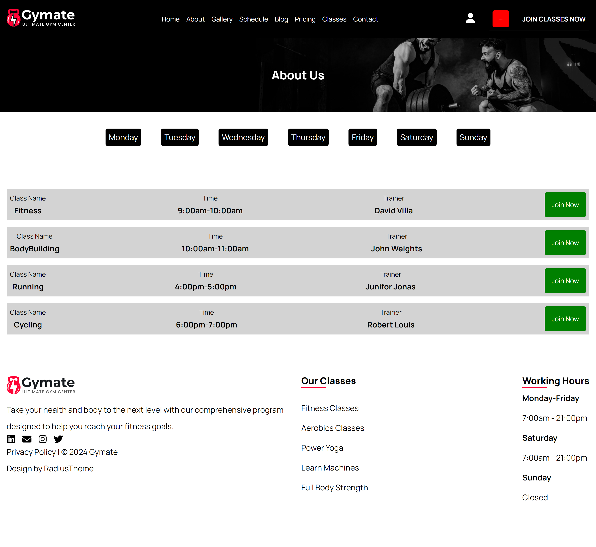
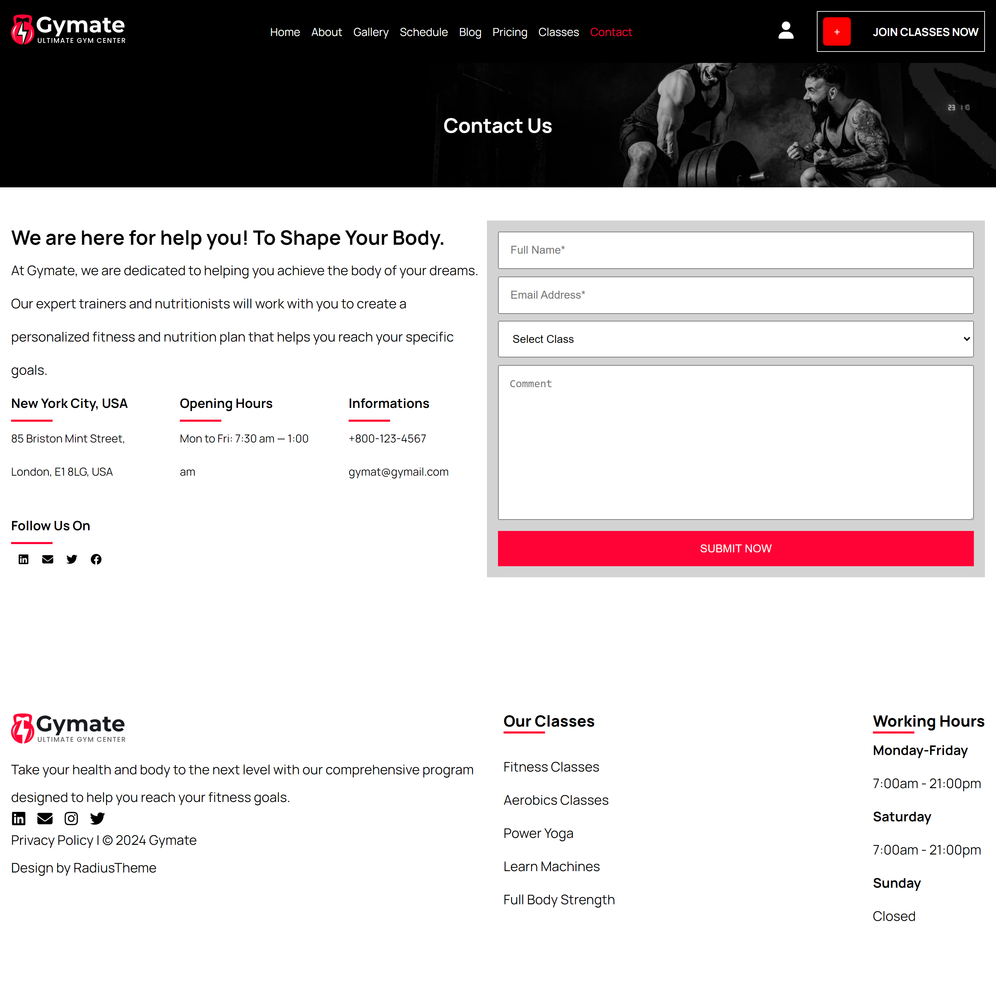
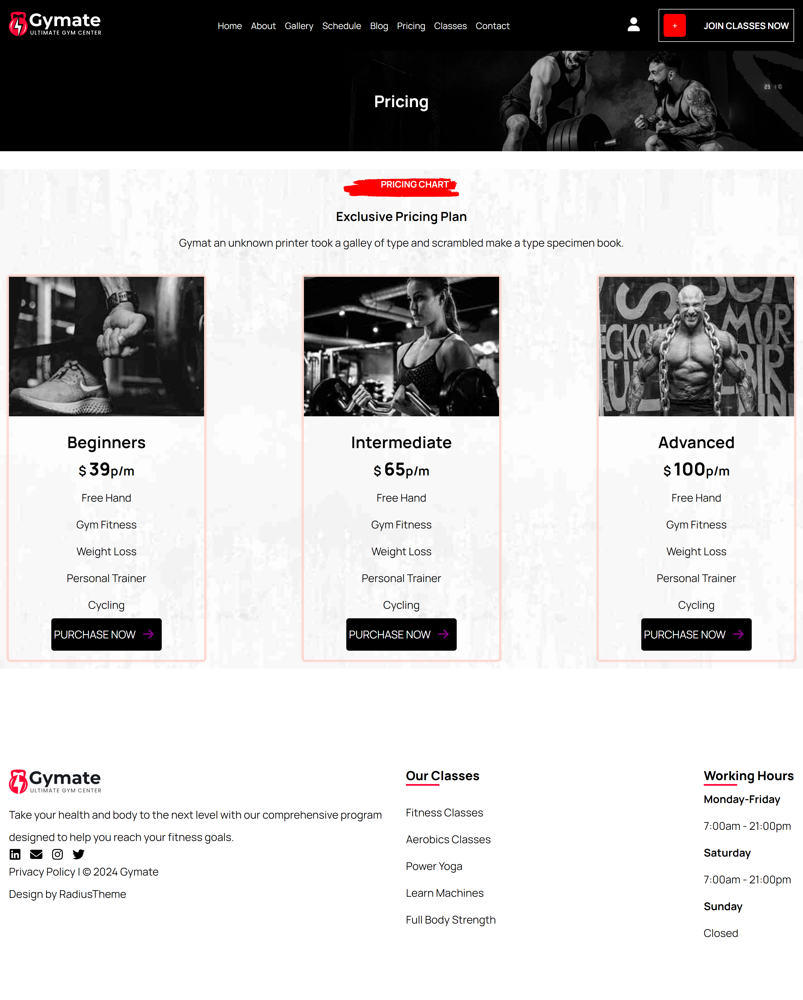
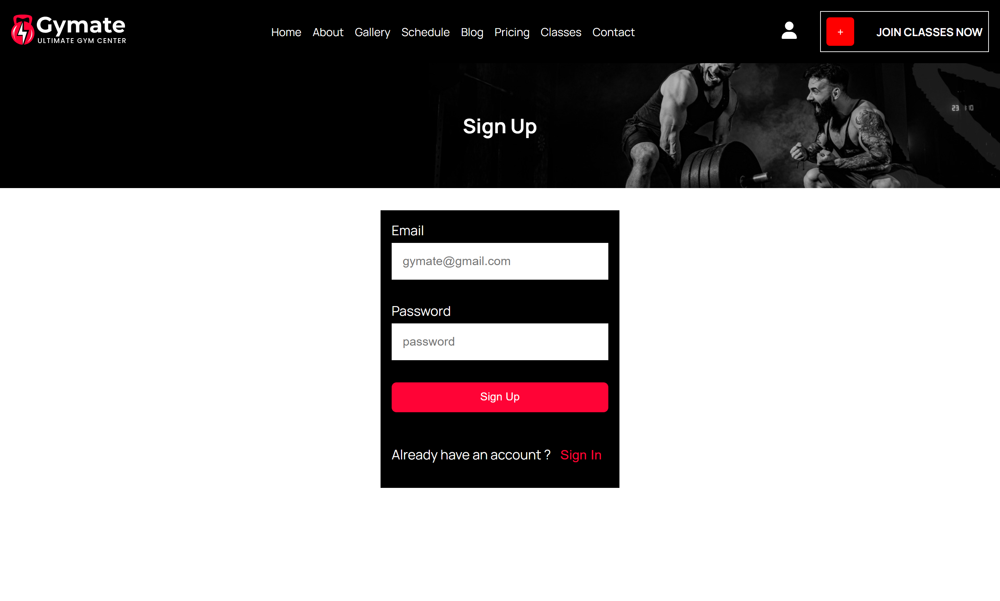
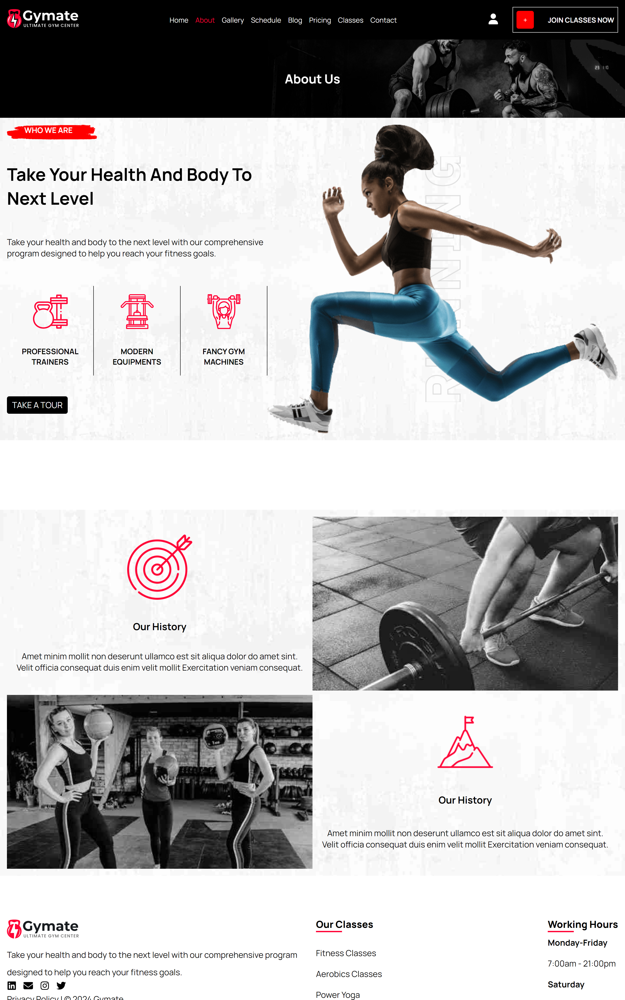

<h2>Screenshots of the Project 📸</h2>
 
<h3 align='center'>Home Page 🏡</h3>

  
<h3 align='center'>Classes Page 👇</h3>

 
 
<h3 align='center'>Blog Page 👇</h3>

 
 
<h3 align='center'>Schedule Page 👇</h3>

 
 
<h3 align='center'>Contact Page 👇</h3>

 
 
<h3 align='center'>Gallery Page 👇</h3>

 
 
<h3 align='center'>Pricing Page 👇</h3>

 
 
<h3 align='center'>Login Page 👇</h3>

 
 
<h3 align='center'>About Page 👇</h3>

 
 

# Fitness Center Website Project

This project is a web application for a fitness center. It includes various pages such as the homepage, about page, gallery page, schedule page, blog page, pricing page, classes page, contact page, and sign-up page.

## Project Structure

The project is structured as follows:

- **Components**: Contains reusable components used throughout the application. In this case, it includes a `NavBar` component located at `./Components/HomepageComponents/Import.js`.

- **Pages**: Contains different pages of the website. Each page is a React component responsible for rendering specific content.
  - `HomePage`: Renders the homepage content.
  - `AboutPage`: Renders information about the fitness center.
  - `GalleryPage`: Renders a gallery of images related to the fitness center.
  - `SchedulePage`: Renders the schedule of classes offered by the fitness center.
  - `SchedulePostPage`: Renders details of a specific class schedule based on the URL parameter.
  - `BlogPage`: Renders blog posts related to fitness and health.
  - `PricingPage`: Renders information about pricing and membership plans.
  - `ClassesPage`: Renders information about different classes offered.
  - `ContactPage`: Renders contact information for the fitness center.
  - `SignUpPage`: Renders a sign-up form for new members.

## Schedule Data

The `App` component manages the state of the schedule, which includes information about various classes offered by the fitness center on different days of the week. The schedule data is stored as an array of objects, with each object representing a day and its corresponding classes.

## Routing

The application uses `react-router-dom` for routing. Different routes are defined for each page, and corresponding components are rendered based on the URL.

## Usage

To run the project locally:

1. Clone the repository.
2. Install dependencies using `npm install`.
3. Start the development server using `npm start`.

## Technologies Used

- React: A JavaScript library for building user interfaces.
- react-router-dom: DOM bindings for React Router, used for routing in the application.

## Contributing

Contributions are welcome! If you'd like to contribute to this project, please fork the repository and submit a pull request with your changes.

## License

This project is licensed under the MIT License - see the [LICENSE](./LICENSE) file for details.
